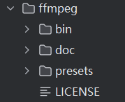
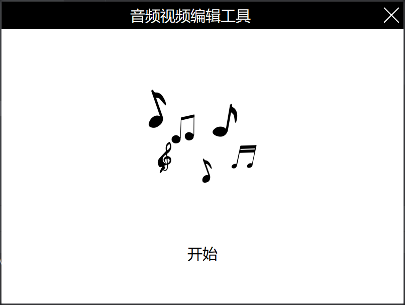

# VTOA - 处理音频的桌面app
VTOA是一个处理音频的windows桌面app。可实现音频提取、格式转换、人声分离、伴奏提取功能。

# 可用功能
* 音频提取：从各种格式的视频中提取视频中的音频文件，可输出为指定音频格式
* 格式转换：音频格式的相互转换，读取各种音频格式转换为指定格式
* 人声分离：上传音频文件后，通过AI推理，分离出音频中的纯净人声
* 伴奏提取：上传音频文件后，通过AI推理，消除音频中的人声

# 使用说明

官网(https://ffmpeg.org/)下载ffmpeg，将其解压到ffmpeg文件夹

执行main.py文件

# requirements
* pyqt5

# 更新日志
2024-12-20
* 支持自定义保存输出文件
